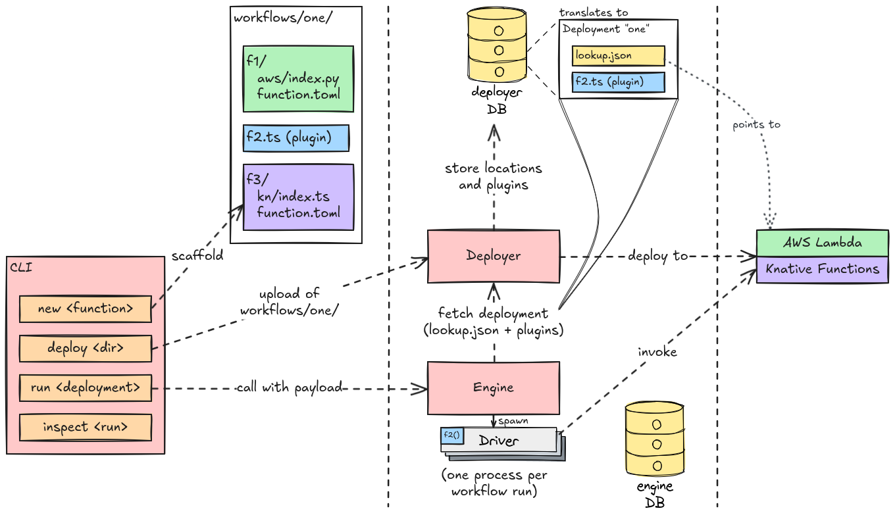

# Architecture

## How does it work?

- Workflows and their functions are developed locally
- The CLI is used to deploy workflows by uploading their code to the deployer
- The deployer stores the workflows and their functions in a database
  - For plugin functions, the deployer stores the TypeScript code of the function
  - For remote functions (e.g., AWS Lambda), the deployer deploys the code to the remote location (e.g., AWS Lambda) and stores a reference to the function (e.g., ARN)
  - On request, the deployer provides the engine with a `lookup.json` file that contains the references to a deployment's functions
- When the CLI calls the engine to execute a workflow, it passes the deployment's name and the input data
- The engine fetches the deployment from the deployer (including `lookup.json` and code for plugin functions)
- Once fetched, the engine spawns a driver instance for the workflow
  - One engine instance can run multiple workflows in parallel, each with its own driver
- The driver executes the workflow by calling the functions in the order defined by the workflow (based on `next`, but also handling child invocations)
  - For plugin functions, the driver imports the plugin code and executes the function
  - For remote functions (e.g., AWS Lambda), the driver invokes the function using the reference stored in `lookup.json`
    - In case of AWS Lambda, the driver uses the AWS SDK to invoke the function
    - In case of Knative, the driver calls the function's Knative service URL

## Why no monolith?

### Separation between engine and deployer

- Allows us to scale the engine (with the per-workflow driver instances executing plugin functions) independently of the deployer.
- Run the engine closer to the data.

### Separation between CLI and engine/deployer (or client and server):

- Allows us to connect to different servers (i.e., environments) from the same client machine.
- There are no requirements on the CLI's environment (no Docker or similar needed).
  - Useful for running the CLI on a less powerful machine or in a CI/CD pipeline.
- A web UI or other client application can be added easily, since the CLI only communicates with the engine and deployer via HTTP as well.
