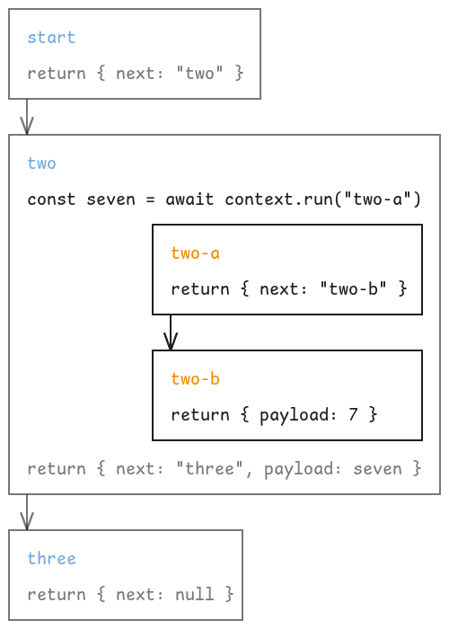

# Run a child function

In the previous chapter, we learned how to instruct the engine what function to run next by specifying the `next` property in the response object.

Another way to control the flow of the workflow is to run a child function from a parent function. We'll see later how this can be useful when implementing more complex workflows.

<div class="warning">

Note that only plugin functions can run child functions. [AWS Lambda functions](./aws-lambda-functions.md) cannot run child functions.

</div>

To run a child function, use the `run` method available on the plugin's `requestBody.context` object. The method takes two arguments: the name of the function to run and the payload to pass to it.

## Example

Here is an example of a plugin that runs a child function called `toUpper` on a string "Hello, world!", awaiting the result and returning it:

```typescript
{{#include ../../../examples/to-upper/start.ts}}
```

The `toUpper` function could be implemented as follows:

```typescript
{{#include ../../../examples/to-upper/toUpper.ts}}
```

Since the child function `toUpper` does not return any `next`, this branch of the workflow will end here and return the uppercase string to the parent function.

## Control flow

<div class="warning">

When the invoked child function returns a `next`, we're rather dealing with a "child workflow" than a simple child function invocation.

</div>

To some extent, the invocation of a child function can be seen as the invocation of a child workflow, where the child workflow consists of a single function.

If a child function returns a `next`, the workflow branch continues with the specified function and payload.

Only when a function does not return a `next`, the branch ends, and control is returned to the parent function, with the Promise of `context.run` resolving to the result of the branch's last function.


